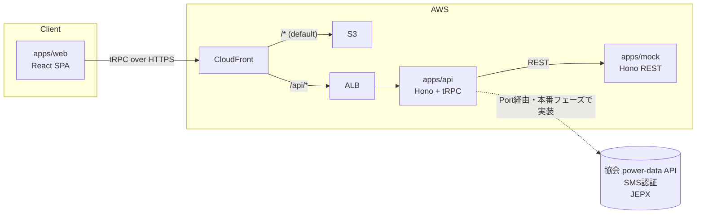
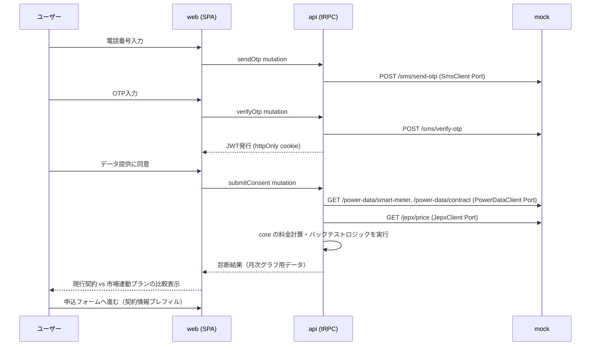

# 設計書: ワンタップ実データ診断

**status**: Draft
**関連**: [../one-pager.md](../one-pager.md)

## 1. 概要

SMS認証と同意タップのみで、電力データ管理協会経由のスマートメーター30分値・契約情報を取得し、現行契約と市場連動プランの過去12ヶ月バックテストをその場で提示、申込フォームへ繋げる新規顧客獲得ファネル。MVPスコープは以下の2点（開発1日）:

- **診断エンジン**: 30分値×市場価格の料金計算とバックテストの月次グラフ（サンプルの30分値データで動作）
- **同意フローのモック**: SMS認証→同意→診断結果の画面遷移

協会加入・API接続（本物の power-data API・SMS認証・JEPX）は本番フェーズで、MVP範囲外。**ただし本番接続を見据え、外部連携はアダプタ境界を切って差し替え可能にする**（詳細は 5 章）。

## 2. モノレポ構成

```text
app/
├── apps/
│   ├── web/      # React + Vite SPA（同意フロー画面）
│   ├── api/      # Hono + tRPC ルーター（診断エンジンの呼び出し層）
│   └── mock/     # Hono REST（協会 power-data / SMS / JEPX のモック実装）
├── packages/
│   └── core/     # ドメイン型 + Port定義 + 料金計算・バックテストロジック
├── infra/        # AWS CDK app（独立 workspace）
└── docs/
    └── design.md # 本書
```

`apps/` = デプロイ単位（ECS Fargate または S3 で個別に配信される）、`packages/` = 共有ライブラリ、という区分。`infra` は CDK app として独立 workspace に置く（アプリケーションコードと依存関係を混在させない）。

## 3. 技術スタック

| 領域 | 選定 | 備考 |
|---|---|---|
| 言語 / ランタイム | TypeScript + Bun | 全パッケージ共通。トランスパイル設定なしで TS を直接実行 |
| ワークスペース | Bun Workspaces | パッケージ数が少なく依存グラフも単純なため、turborepo 等は導入しない |
| `web` | React + Vite（SPA） | S3 + CloudFront の静的配信と整合 |
| `api` / `mock` | Hono | tRPC の公式 Hono adapter で `api` を実装。`mock` は素の REST |
| `web` ⇔ `api` 型共有 | tRPC | コード生成不要。`api` の router 型をそのまま `web` が import |
| `api` ⇔ `mock` 通信 | REST（JSON over HTTP） | `mock` は本物の外部 API を模す位置づけのため、内部専用の tRPC で結合しない |
| 外部連携アダプタ境界 | Port/Adapter パターン | `core` に Port（interface）を定義。詳細は 5 章 |
| スタイリング | Tailwind CSS | |
| フロントエンド状態管理 | TanStack Query（tRPC統合）+ React state | 画面数が少なく、グローバル状態管理ライブラリは導入しない |
| テスト | Vitest（unit）+ Playwright（e2e） | e2e は同意フローの画面遷移を検証 |
| Lint / Format | Biome | |
| CI | GitHub Actions | |
| IaC | AWS CDK（TypeScript） | `infra/` workspace |
| データ永続化 | なし（MVPスコープ） | 4 章参照 |

## 4. アーキテクチャ / データフロー



CloudFront を単一オリジンとして使い、パスパターン（`/api/*` → ALB、それ以外 → S3）でオリジンを分岐する。これにより `web`/`api` を同一オリジンにまとめ、CORS 設定を不要にする。

### データフロー（同意フロー）



## 5. 外部連携アダプタ境界（Port/Adapter パターン）

`core` に外部連携ごとのインターフェース（Port）を定義し、`api` はこの Port にのみ依存する。実装（Adapter）は起動時の環境変数で注入する。MVP では以下の Port と、`mock` サービスを叩く Adapter のみを実装する。本番接続時は同じ Port を満たす Adapter を追加するだけで済む。

`PowerDataClient` の `contractId` は client から直接渡させず、JWT に紐づくサーバー側セッションから解決する（6章参照）。client 入力の `contractId` をそのまま Port へ渡す実装は IDOR のリスクがある。

```typescript
// packages/core/src/ports/power-data-client.ts
export interface PowerDataClient {
  getSmartMeterReadings(contractId: string, period: DateRange): Promise<SmartMeterReading[]>;
  getContractInfo(contractId: string): Promise<ContractInfo>;
}

// packages/core/src/ports/sms-client.ts
export interface SmsClient {
  sendOtp(phoneNumber: string): Promise<{ requestId: string }>;
  verifyOtp(requestId: string, code: string): Promise<{ verified: boolean }>;
}

// packages/core/src/ports/jepx-client.ts
export interface JepxClient {
  getMonthlyPrices(period: DateRange): Promise<MonthlyPrice[]>;
}
```

```typescript
// apps/api/src/adapters/mock-power-data-client.ts
export class MockPowerDataClient implements PowerDataClient {
  constructor(private baseUrl: string) {}
  async getSmartMeterReadings(contractId, period) {
    const res = await fetch(`${this.baseUrl}/power-data/smart-meter?...`);
    return res.json();
  }
  // ...
}
```

`mock` サービスが提供するエンドポイント（REST）:

| エンドポイント | 用途 |
|---|---|
| `GET /power-data/smart-meter` | 30分値のサンプルデータ |
| `GET /power-data/contract` | 契約情報（契約電力・契約名義等）のサンプルデータ |
| `POST /sms/send-otp` / `POST /sms/verify-otp` | SMS認証のシミュレーション |
| `GET /jepx/price` | 過去12ヶ月分の市場価格サンプルデータ |

## 6. 認証・セッション設計

診断フローは会員登録のない単発フローのため、永続的なユーザーアカウントは持たない。

1. `SmsClient` Port 経由で OTP 発行・検証を行う（MVP では `mock` がシミュレート）
2. OTP検証成功後、`api` が本人確認済みの電話番号（主体識別子）を紐づけた短命 JWT（有効期限 15 分程度）を発行し、cookie に `HttpOnly; Secure; SameSite=Lax` 属性で設定する
3. 以降の診断フロー（データ取得・料金計算）の tRPC 呼び出しは、tRPC の `context` でこの JWT を検証する軽量セッションとして扱う。**`PowerDataClient` 等の Port 呼び出しに使う識別子（`contractId` 等）は client から渡させず、この JWT に紐づく主体識別子からサーバー側で解決する**（5章参照）
4. 診断結果は `web` 側の state で保持し、申込フォーム遷移時にそのまま契約情報をプレフィルする（サーバー側に永続化しない）
5. cookie 認証の状態変更系 mutation（`sendOtp` / `verifyOtp` / `submitConsent`）は CSRF 対策として `Origin` / `Sec-Fetch-Site` ヘッダ検証を行う（同一オリジン構成で CORS 設定は不要になるが、CSRF 境界は別途必要）

## 7. バックテスト計算ロジック（`packages/core`）

30分値 × 市場価格の料金計算・現行契約とのバックテスト比較は、`core` にフレームワーク非依存の純粋関数として実装する。

```typescript
// packages/core/src/domain/backtest.ts
export function calculateBacktest(
  readings: SmartMeterReading[],
  currentPlan: PricingPlan,
  marketPrices: MonthlyPrice[],
): MonthlyComparison[] { /* ... */ }
```

`apps/api` の tRPC ルーターはこの関数を呼び出すだけの薄い層に留める。これにより `core` は「ドメイン型 + Port定義 + ドメインロジック」を持つ一貫した責務になり、Vitest でのユニットテストも tRPC/Hono の起動なしに書ける。

## 8. AWS構成

- 単一環境（dev/stg/prod のような環境分割は MVP スコープ外。one-pager に記載なく、必要になれば追加する）
- `web`: S3（静的ホスティング）+ CloudFront（CDN配信、HTTPS終端）
- `api` / `mock`: ECS Fargate（Private Subnet）+ ALB（Public Subnet）
- CloudFront はパスパターン（`/api/*` → ALB、それ以外 → S3）でオリジンを分岐し、`web`/`api` を同一オリジンにまとめる
- 証明書は ACM（CloudFront 用は us-east-1、ALB 用はデプロイ先リージョン）
- 独自ドメイン（Route53）は one-pager に記載がなく MVP スコープ外。CloudFront のデフォルトドメイン（`*.cloudfront.net`）で運用する
- `infra/` の CDK app が上記一式（VPC・ECS・ALB・S3・CloudFront・ACM）を定義する

## 9. CI/CD

GitHub Actions で lint（Biome）/ typecheck / test（Vitest, Playwright）を実行する。デプロイ（CDK deploy、S3 sync、ECS service update）はこの設計書の対象範囲では手順のみ定義し、自動化の要否は実装フェーズで判断する。

## 10. 未決事項・MVPスコープ外

- 協会加入・本番 power-data API / SMS認証 / JEPX 接続（`core` の Port を満たす本番 Adapter の実装）
- KPI計測基盤（着地→同意完了率 / 診断→申込CVR 等のイベントログ）・データ永続化
- dev/stg/prod の環境分割、独自ドメイン
- スイッチング以前データの欠落、旧型計器・定額電灯契約のフォールバック（スクショ/CSVアップロードの簡易診断）
